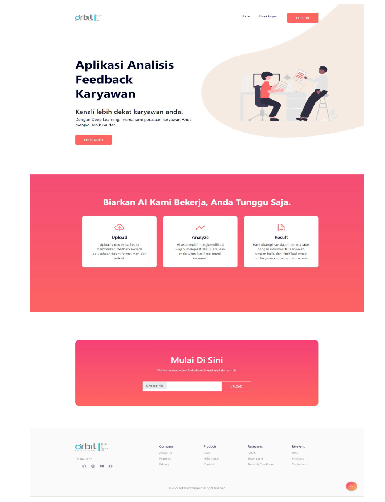

# Employee Feedback Analysis


<h3 align="center">🎥 An AI-Powered System for Analyzing Employee Feedback Videos 🎥</h3>

<p align="center">
  This project uses face recognition, speech-to-text, and BERT for emotion classification to provide deep insights into employee sentiment from video feedback.
</p>

<p align="center">
  <!-- Badges/Shields -->
  
  
  
  
  
</p>

---

## 📝 Description

The **Employee Feedback Analysis** system is a web application designed to collect and analyze employee feedback through video uploads. It utilizes advanced machine learning techniques to process and classify emotions from both facial expressions and speech content. The system identifies employees, transcribes their spoken words, and classifies the sentiment into categories such as **angry**, **happy**, **sadness**, **fear**, and **love**, aiming to provide actionable insights into the workplace environment.

## 🤖 About The Project

The **Employee Feedback Analysis** system allows employees to upload video reviews about their workplace. The system leverages a multi-stage AI pipeline to process these videos:

1.  **Face Recognition** identifies the employee.
2.  **Speech Recognition** transcribes the spoken feedback into text.
3.  A **BERT-based model** classifies the text into one of five emotional categories.

This provides valuable, structured insights into employee sentiment, helping organizations better understand and improve their workplace environment.

## ✨ Key Features

-   ✅ **Video Upload:** A simple interface for users to upload video feedback.
-   ✅ **Face Recognition:** Automatically identifies employees from video streams.
-   ✅ **Speech-to-Text Conversion:** Accurately extracts and transcribes spoken words.
-   ✅ **Advanced Emotion Classification:** Utilizes a powerful BERT model for nuanced emotion analysis from text.
-   ✅ **User-Friendly Interface:** A web-based interface for seamless interaction.

## 🛠️ Technologies Used

-   **Backend:** Python, Flask
-   **Frontend:** HTML, CSS, JavaScript
-   **Machine Learning Pipeline:**
    -   **Face Recognition:** `face_recognition` library
    -   **Speech Recognition:** `SpeechRecognition` library
    -   **Emotion Classification:** BERT model with TensorFlow/Keras
-   **UI/UX Design:** Figma

## 🚀 Getting Started

Follow these steps to set up and run the project on your local machine.

### 1. Prerequisites

-   Python 3.x
-   pip (Python package installer)

### 2. Installation & Setup

1.  **Clone the Repository**:
    ```
    git clone [this project]
    cd project
    ```

2.  **Set Up a Virtual Environment** (Recommended):
    ```bash
    python -m venv venv
    # On Windows: venv\Scripts\activate
    source venv/bin/activate
    ```

3.  **Install Dependencies**:
    Install required Python packages:
    ```bash
    pip install -r requirements.txt
    ```

4.  **Set Up Models**:
    -   Place pre-trained models (face recognition, speech recognition, and BERT) in the `model/` directory.
    -   Configure paths to models in `predict.py` if necessary.

### 3. Running the Application

Start the Flask server:
```bash
python app.py
```
Access the application at `http://localhost:5000` in your web browser.

## 📂 Project Structure

-   **model/**: Contains machine learning models and scripts.
    -   `face_recognition_model`: Pre-trained model for face recognition.
    -   `speech_recognition_model`: Model or scripts for speech-to-text conversion.
    -   `bert_model`: Pre-trained BERT model for emotion classification.
    -   `predict.py`: Script to load models and perform predictions.
-   **templates/**: Stores HTML files for the front-end interface.
-   **app.py**: Main back-end script integrating the front-end, face recognition, speech recognition, and BERT-based emotion classification.

## 📖 Usage

1.  Open the web application in a browser.
2.  Upload a video file containing your workplace feedback.
3.  The system will:
    -   Perform face recognition to identify the employee.
    -   Extract and transcribe speech from the video.
    -   Classify the transcribed text into one of five emotions (angry, happy, sadness, fear, love).
4.  View the results, including the identified employee and the classified emotion, on the web interface.

## 📸 Screenshots




## 🤝 Contributing

Contributions are welcome! To contribute:

1.  **Fork** the repository.
2.  Create your **Feature Branch** (`git checkout -b feature/Amazing-AI-Enhancement`).
3.  **Commit** your changes (`git commit -m 'feat: Add some Amazing-AI-Enhancement'`).
4.  **Push** to the Branch (`git push origin feature/Amazing-AI-Enhancement`).
5.  Open a **Pull Request**.

## 📄 License

This project is licensed under the [MIT License](https://opensource.org/license/mit). See the LICENSE file for details.

## 📬 Contact

For inquiries or feedback, please contact the team:

-   **Widi Afandi:** [widiafandi58@gmail.com](mailto:widiafandi58@gmail.com)
-   **Satria Nur Saputro:** [satrianursaputro06@gmail.com](mailto:satrianursaputro06@gmail.com)
